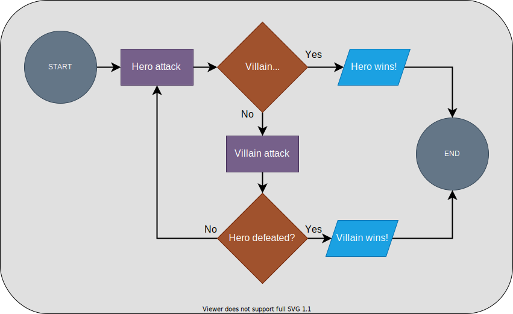

# Unit 4 Practice Solutions

## **Exercise 2 Solution**

### **2.1**

<div align="center">

</div>

<br><br>

As shown in the flowchart, this solution will consists of a REPL loop performing a series of two actions for each character.

1. One of the characters will attack and the other's `hp` will be reduced.
2. Check if the non-attacking character's `hp` is less than or equal to zero (i.e. they've been defeated).

As soon as one character is defeated, a message will print saying who won the battle and the loop will end.

We'll be adding an `input()` before each character attacks to make the battle more interactive. This step isn't represented in the flowchart, but will be in the code.

We'll also be adding `print()` functions periodically to provide feedback on the status of the battle to the user.

```python
# ----------------------------------------------------------- #
# Setup
# ----------------------------------------------------------- #


# define hero/villain stats
hero = {
    "name": "Andromeda",
    "hp": 100,
    "attack": 35
}

villain = {
    "name": "Helios",
    "hp": 100,
    "attack": 33
}

def is_defeated(character):
    '''
    Returns False if the character's hp is greater than zero
    Returns True if the character's hp is less than or equal to
    '''
    return character['hp'] <= 0


# ----------------------------------------------------------- #
# Battle!
# ----------------------------------------------------------- #

while True:
    # display hp
    print(f"{hero['name']} has {hero['hp']} hp!")
    print(f"{villain['name']} has {villain['hp']} hp!")

    input("\nPress enter to begin the battle!")

    # Hero attacks
    print(f"\n{hero['name']} attacks!")

    # subtract hero's attack strength from the villain's hp
    villain['hp'] -= hero['attack']

    # check if the villain is defeated
    if is_defeated(villain):
        print(f"{villain['name']} has been defeated! {hero['name']} is victorious!")
        break # end the loop
    
    # display hp
    print(f"{hero['name']} has {hero['hp']} hp!")
    print(f"{villain['name']} has {villain['hp']} hp!")

    input("\nPress enter to continue the battle!")
 
    # Villain attacks
    print(f"\n{villain['name']} attacks!")

    # subtract hero's attack strength from the villain's hp
    hero['hp'] -= villain['attack']

    # check if the hero is defeated
    if is_defeated(hero):
        print(f"\n{hero['name']} has been defeated! {villain['name']} is victorious!")
        break # end the loop

```


Keep in mind that this is just one potential solution.

## [< Exercise 2](../exercise_2.md) | [2.2 Solution >](./exercise_2_2_solution.md)

---

### [<< Back to Unit 4 Practice](/practice/unit_4/)
