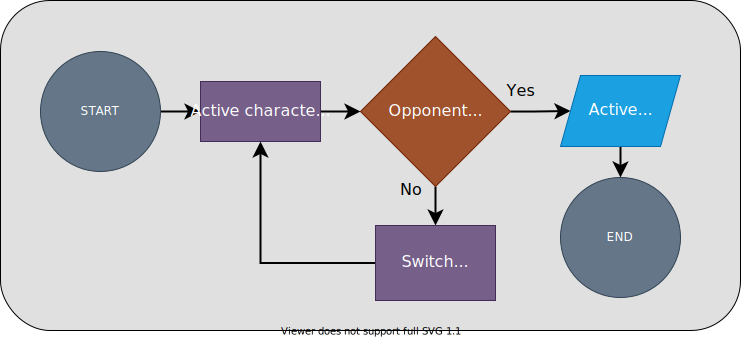

# Unit 4 Practice Solutions

## **Exercise 2 Solution**

### **2.2**

<div align="center">

</div>

<br><br>

Since the hero and the villain were both performing the same actions each round, we can reduce repetition by writing more generic logic that can apply to either character.

Here we've created a function called `attack()` which is going to handle the active character's turn. We'll pass the current `attacker` and their `opponent` and the process of applying damage to the opponent will take place inside the function. 

We'll also use the `is_defeated()` function to return a boolean from `attack()` indicating whether or not the battle is over.

```python
# ----------------------------------------------------------- #
# Setup
# ----------------------------------------------------------- #

hero = {
    "name": "Andromeda",
    "hp": 100,
    "attack": 35
}

villain = {
    "name": "Helios",
    "hp": 100,
    "attack": 33
}

def is_defeated(character):
    '''
    Returns False if the character's hp is greater than zero
    Returns True if the character's hp is less than or equal to
    '''
    return character['hp'] <= 0


def attack(active, opponent):
    '''
    Apply battle damage to the opponent using the active characters's attack stat
    If the opponent is defeated, return True, signifying the battle is over
    Otherwise return False, signifying the battle will continue for another round
    '''
    print(f"{active['name']} has {active['hp']} hp!")
    print(f"{opponent['name']} has {opponent['hp']} hp!")

    input("\nPress enter to battle!")

    # active character attacks
    print(f"\n{active['name']} attacks!")

    # subtract active character's attack strength from the opponents's hp
    opponent['hp'] -= active['attack']

    # return True if the opponent is defeated, otherwise False
    return is_defeated(opponent)

# ----------------------------------------------------------- #
# Battle!
# ----------------------------------------------------------- #


# this will alternate between 0 and 1 to decide whose turn it is
turn_counter = 0

while True:

    # stat dictionaries stored at matching keys
    all_stats = {
        'hero': hero,
        'villain': villain
    }

    # keys for the all_stats dictionary
    # the turn_counter will alternate between 0 and 1 to decide whose turn it is
    stat_keys = list(all_stats.keys()) # ['hero', 'villain']

    # get the key of the active character
    active_key = stat_keys[turn_counter]
    # get the stat dictionary of the active character
    active = all_stats[active_key]


    # get the key of the opponent
    # index -1 if turn_counter is 0
    # index 0 if the turn_counter is 1
    opponent_key = stat_keys[turn_counter - 1]
    # get the stat dictionary of the opponent
    opponent = all_stats[opponent_key]

    # execute current round of battle
    # receive True if opponent is defeated, otherwise False
    victorious = attack(active, opponent)

    # check the outcome of the battle. 
    # if the opponent was defeated, end the loop
    if victorious:
        print(f"{opponent['name']} has been defeated! {active['name']} is victorious!")
        break # end the loop


    # increment the turn_counter
    turn_counter += 1

    # make sure the turn_counter will only ever be 0 or 1 using % 2; if/elif could be used instead
    turn_counter %= 2
```


Keep in mind that this is just one potential solution.

## [< 2.1 Solution](./exercise_2_1_solution.md)| [2.3 Solution >](./exercise_2_3_solution.md)

---

### [<< Back to Unit 4 Practice](/practice/unit_4/)
