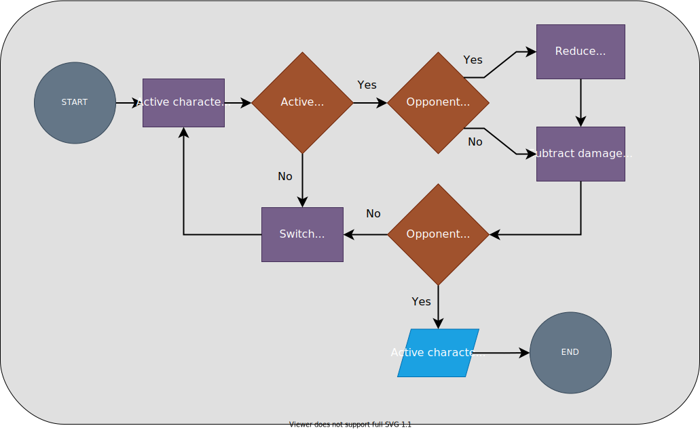

# Unit 4 Practice Solutions

## **Exercise 2 Solution**

### **2.3**

<div align="center">

</div>

<br><br>

In this version, we're going to allow the active player to choose if they want to attack or defend each round. If they choose to defend, the next damage they receive will be reduced based on their `defense` stat.

We'll be introducing two more functions, `set_stance()` and `defend()`.

### `set_stance()`

This function will contain a REPL which will allow the user to choose which stance the active character should take this round. The function will take in the user's input, set the active character's stance stat and return the updated character dictionary.

### `defend()`

This function will take in the opponent's stat dictionary and the amount of incoming damage from the active player's `attack` stat, reduce the incoming damage based on the opponent's `defense` stat and return the reduced damage amount.

```python

# ----------------------------------------------------------- #
# Setup
# ----------------------------------------------------------- #
hero = {
    "name": "Andromeda",
    "hp": 100,
    "attack": 7,
    "defense": 6,
    "stance": "" # 'attack' or 'defend'
}

villain = {
    "name": "Helios",
    "hp": 100,
    "attack": 5,
    "defense": 5,
    "stance": "" # 'attack' or 'defend'
}


def is_defeated(character):
    '''
    Returns False if the character's hp is greater than zero
    Returns True if the character's hp is less than or equal to
    '''
    return character['hp'] <= 0


def set_stance(character):
    '''
    Set the character's stance stat with user 
    input and return the updated dictionary
    '''

    stance_options = {
        '1': 'attack',
        '2': 'defend'
    }

    prompt = f"""
    {character['name']}, how would you like to proceed?

    1. Attack
    2. Defend

    Enter the number of the option 
    > """

    stance_number = input(prompt)

    # make sure the user entered a valid selection
    while stance_number not in stance_options.keys():
        print('\n!***! Invalid selection !***!')
        stance_number = input(prompt)

    # Once the user has entered a valid selection, set the dictionary-    
    character['stance'] = stance_options[stance_number]

    return character


def defend(character, incoming_damage):
    '''
    Calculate the amount the incoming_damage will be reduced 
    based on the character's 'defense' stat. 
    
    Return the amount the incoming_damage will be reduced
    in a variable called 'damage_reduction'
   
    0 - 4 = 10%, 5 - 7 = 33%, 8 - 10 = 66%
    '''
    defense = character['defense']
    if defense < 5:
        damage_reduction = incoming_damage * .1
    elif defense < 8:
        damage_reduction = incoming_damage * .33
    else:
        damage_reduction = incoming_damage * .66

    # return the reduction amount, rounded to the nearest integer
    return round(damage_reduction)


def attack(active, opponent):
    '''
    Apply battle damage to the opponent using the attacker's attack stat
    If the opponent is defeated, return True, signifying the battle is over
    Otherwise return False, signifying the battle will continue for another round
    '''
    battle_over = False

    print("\n" + ("-" * 50)) # print a divider

    # display hp
    print(f"\n{active['name']} has {active['hp']} hp!")
    print(f"{opponent['name']} has {opponent['hp']} hp!")

    input("\nPress enter to battle!")


    # active character chooses stance
    active = set_stance(active)

    print("\n" + ("-" * 50)) # print a divider
    
    if active['stance'] == 'attack':
        # active character attacks
        print(f"\n{active['name']} attacks!")

        # damage to be dealt to the opponent
        damage = active['attack'] * 5 # multiply damage to speed up the game

        # if the opponent chose to defend last turn
        if opponent['stance'] == 'defend':
            # calculate the damage reduction
            damage_reduction = defend(opponent, damage)   

            # reduce damage
            damage -= damage_reduction

            print(f"\n{opponent['name']} defends! Damage reduced by {damage_reduction}!") 

        # subtract attackers's attack strength from the opponents's hp
        opponent['hp'] -= damage

        print(f"{opponent['name']} takes {damage} damage!")

    elif active['stance'] == 'defend':
        print(f"\n{active['name']}, the next damage you receive will be reduced!")

    # return True if the opponent is defeated, otherwise False
    return is_defeated(opponent)


# ----------------------------------------------------------- #
# Battle!
# ----------------------------------------------------------- #

# this will alternate between 0 and 1 to decide whose turn it is
turn_counter = 0

while True:

    # stat dictionaries stored at matching keys
    all_stats = {
        'hero': hero,
        'villain': villain
    }

    # keys for the all_stats dictionary
    # the turn_counter will alternate between 0 and 1 to decide whose turn it is
    stat_keys = list(all_stats.keys()) # ['hero', 'villain']

    # get the key of the active player
    active_key = stat_keys[turn_counter]
    # get the stat dictionary of the active player
    active = all_stats[active_key]


    # get the key of the current opponent
    # index -1 if turn_counter is 0
    # index 0 if the turn_counter is 1
    opponent_key = stat_keys[turn_counter - 1]
    # get the stat dictionary of the opponent
    opponent = all_stats[opponent_key]

    # execute current round of battle
    # receive True if opponent is defeated, otherwise False
    victorious = attack(active, opponent)

    # check the outcome of the battle. 
    # if the opponent was defeated, end the loop
    if victorious:
        print(f"\n{opponent['name']} has been defeated! {active['name']} is victorious!")
        break # end the loop

```


Keep in mind that this is just one potential solution.

## [< 2.2 Solution](./exercise_2_2_solution.md)
---

### [<< Back to Unit 4 Practice](/practice/unit_4/)
